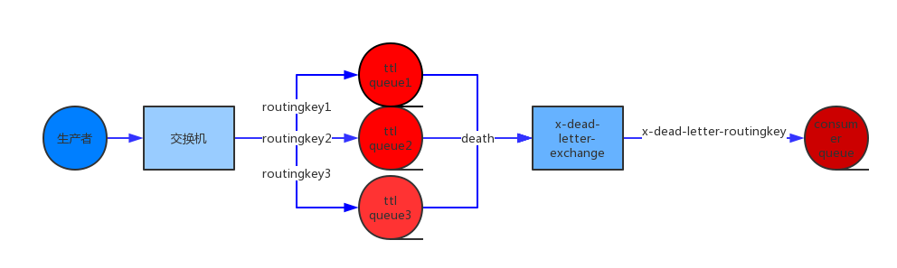

#### delay(闪电) 是一个轻量级分布式任务延迟调度平台。基于rabbitmq+redis+quartz实现 

#### **Features**:

 1. 简单:服务提供restful api 简单操作;
 2. 动态:支持动态修改延迟任务的状态;
 3. 任务失败重试:可配置重试机制。默认不重试,由业务方控制重试开关和次数(延迟调用 默认延迟 1分钟 第二次2分钟 第三次3分钟);
 4. 分钟级别的延迟调度任务，(毫秒级也可以支持,下期优化);   
 5. 调度时间无限制(小于一分钟的立马执行)。 
 6. 支持内部(eureka)以及外部调用，任务planType 区分。
 7. 支持自动删除数据任务(执行时间之前的数据)`auto.delete.enabled=true` 开启自动删除任务默认关闭`auto.delete.retainDays`删除执行日期当前时间之前的数据默认5天
 8. 过期未执行任务配置是否进行消费执行。

#### **Project structure**:

```java_holder_method_tree
    .
└── src
    ├── main
    │   ├── java
    │   │   └── com
    │   │       └── sober
    │   │               └── delay
    │   │                   ├── aspect (aop)
    │   │                   ├── common  (公共类)
    │   │                   │   └── result
    │   │                   ├── config  (配置类)
    │   │                   ├── dao   (dao 接口)
    │   │                   ├── entity  (实体)
    │   │                   │   ├── dto
    │   │                   │   └── params
    │   │                   ├── enums  (枚举类)
    │   │                   ├── exception (异常类)
    │   │                   ├── handler  (mq handler)
    │   │                   ├── timer  (定时器)
    │   │                   ├── service  
    │   │                   │   └── impl
    │   │                   ├── validate (参数检验)
    │   │                   │   └── group
    │   │                   └── web  (resetful resource)
    │   └── resources (配置资源静态文件)
    └── test  （测试类）
```

#### **reabbitMq**:

 利用rabbitmq的消息TTL和死信Exchange 两个特性实现延迟调用  
 
 1. 消息的TTL（Time To Live）消息的TTL就是消息的存活时间。RabbitMQ可以对队列和消息分别设置TTL。对队列设置就是队列没有消费者连着的保留时间，也可以对每一个单独的消息做单独的设置。超过了这个时间，我们认为这个消息就死了，称之为死信。如果队列设置了，消息也设置了，那么会取小的。所以一个消息如果被路由到不同的队列中，这个消息死亡的时间有可能不一样（不同的队列设置）。这里单讲单个消息的TTL，因为它才是实现延迟任务的关键。可以通过设置消息的expiration字段或者x-message-ttl属性来设置时间，两者是一样的效果。
 2. Dead Letter Exchanges 一个消息在满足如下条件下，会进死信路由，记住这里是路由而不是队列，一个路由可以对应很多队列。Dead Letter Exchange其实就是一种普通的exchange，和创建其他exchange没有两样。只是在某一个设置Dead Letter Exchange的队列中有消息过期了，会自动触发消息的转发，发送到Dead Letter Exchange中去。
   
   
 
